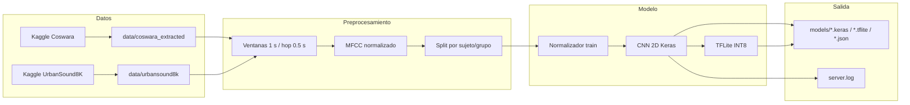

# Pulneo — Pipeline RAD para respiración

Proyecto orientado a entrenar un detector acústico binario de actividad respiratoria (**RAD**, Respiratory Activity Detection) para fisioterapia respiratoria. El pipeline usa respiraciones reales de **Coswara**, ruido ambiental real de **UrbanSound8K**, características **MFCC**, una **CNN 2D liviana**, exportación a **TensorFlow Lite INT8** y métricas reproducibles para comparar ejecuciones.

---

## Tabla de contenidos

1. [Qué Hace Este Repositorio](#qué-hace-este-repositorio)
2. [Arquitectura del pipeline](#arquitectura-del-pipeline)
3. [Estructura del proyecto](#estructura-del-proyecto)
4. [Requisitos](#requisitos)
5. [Instalación](#instalación)
6. [Cómo ejecutar](#cómo-ejecutar)
7. [Salidas generadas](#salidas-generadas)
8. [Dataset y Kaggle](#dataset-y-kaggle)
9. [Modelo ML (entrada / salida)](#modelo-ml-entrada--salida)
10. [Clasificación clínica posterior](#clasificación-clínica-posterior)
11. [Uso del `.tflite` en una app](#uso-del-tflite-en-una-app)
12. [Solución de problemas](#solución-de-problemas)
13. [Autoría y contribuciones](#autoría-y-contribuciones)
14. [Créditos de datasets](#créditos-de-datasets)

---

## Qué hace este repositorio

En un **único script Python** (`server.py`) se encadena todo lo necesario para:

1. Verificar o descargar **Coswara** con `kagglehub`.
2. Extraer audios `breathing-deep.wav` de sujetos `healthy` usando `combined_data.csv`.
3. Verificar o descargar **UrbanSound8K** para construir la clase negativa con ruido ambiental real.
4. Cargar audio mono a 16 kHz, normalizar ganancia por archivo y dividir en ventanas solapadas de 1 segundo.
5. Convertir cada ventana a **MFCC** con forma fija.
6. Separar train/validación/test por sujeto o archivo para evitar fuga de datos.
7. Ajustar el normalizador solo con train y reutilizarlo en validación, test e inferencia.
8. Entrenar una **CNN 2D** compacta para clasificar `ruido/silencio/ambiente` vs. `actividad respiratoria`.
9. Calibrar el umbral RAD con F1 en validación y evaluar Keras en test.
10. Exportar a **TensorFlow Lite INT8**, evaluar el modelo cuantizado y guardar métricas.
11. Registrar la ejecución en `server.log` y generar metadatos del experimento.

La CNN solo detecta actividad respiratoria. La etiqueta clínica (`correct`, `short_or_interrupted`, `weak`) se calcula después con reglas temporales y RMS, no como una tercera clase del modelo.

---

## Arquitectura del pipeline



- **Clase 1:** actividad respiratoria en `breathing-deep.wav` de sujetos `healthy` de Coswara.
- **Clase 0:** ruido, silencio o ambiente desde UrbanSound8K.
- **Fallback sintético:** existe solo para depuración (`allow_synthetic_negative_fallback=True`), pero está desactivado por defecto y no se recomienda para resultados científicos.

---

## Estructura del proyecto

| Ruta / archivo | Descripción |
|----------------|-------------|
| `server.py` | Script principal: datasets, ventanas de audio, MFCC, entrenamiento, evaluación, TFLite INT8 y metadatos. |
| `requirements.txt` | Dependencias Python del pipeline. |
| `data/coswara_extracted/` | Generado: audios positivos `breathing-deep.wav` organizados por sujeto. |
| `data/urbansound8k/` | Generado o usado localmente: audios negativos de ruido ambiental real. |
| `models/` | Generado: modelo Keras, modelo TFLite INT8, normalizador, métricas, historial y metadatos. |
| `server.log` | Generado: histórico en modo append con consola y stderr de cada ejecución. |
| `normalizer_mfcc.py` | Utilidad auxiliar para convertir `models/normalizer_mfcc.npz` a JSON si una app lo necesita. |
| `.venv/` | Opcional: entorno virtual local (no suele versionarse). |

La lógica end-to-end vive en `server.py`. Los artefactos generados no deberían editarse manualmente.

---

## Requisitos

- **Python** 3.10 u 3.11 (recomendado para TensorFlow 2.x estable en Windows).
- **Espacio en disco:** varios GB para caché de Kaggle, Coswara, UrbanSound8K y archivos `.tar` temporales.
- **Red:** obligatoria la primera vez que se descargan los datasets.
- **RAM / CPU:** TensorFlow, librosa y la extracción de características pueden ser exigentes; GPU opcional.
- **Kaggle:** cuenta o credenciales si `kagglehub` las solicita.

---

## Instalación

Desde la raíz del repositorio:

```bash
python -m venv .venv
```

**Windows (PowerShell):**

```powershell
.\.venv\Scripts\Activate.ps1
pip install -U pip
pip install -r requirements.txt
```

**Linux / macOS:**

```bash
source .venv/bin/activate
pip install -U pip
pip install -r requirements.txt
```

En Windows, si `librosa` falla al leer WAV, suele ayudar instalar también:

```bash
pip install soundfile
```

---

## Cómo ejecutar

Activa el entorno virtual y, en la carpeta del proyecto:

```bash
python server.py
```

No hace falta ejecutar pasos manuales previos: el script verifica caché local, descarga lo que falte, entrena el modelo y genera artefactos bajo `models/`.

---

## Salidas generadas

| Salida | Contenido |
|--------|-----------|
| `models/respiro_rad_mfcc.keras` | Modelo Keras entrenado sobre MFCC. |
| `models/respiro_rad_mfcc_int8.tflite` | Modelo TensorFlow Lite con cuantización full INT8. |
| `models/normalizer_mfcc.npz` | Media, desviación estándar y parámetros de extracción usados para inferencia. |
| `models/metrics_keras.json` | Métricas del modelo Keras en test. |
| `models/metrics_tflite.json` | Métricas y latencia del modelo TFLite INT8 en test. |
| `models/training_history.json` | Historial de entrenamiento de Keras. |
| `models/experiment_metadata.json` | Configuración, constantes derivadas, resumen de datasets y rutas de artefactos. |
| `server.log` | Histórico en modo append con timestamp y salida completa del pipeline. |
| `data/coswara_extracted/` | Árbol local con `breathing-deep.wav` por sujeto. |
| `data/urbansound8k/` | Copia local o referencia cacheada de negativos reales. |

Puedes borrar `data/coswara_extracted/`, `data/urbansound8k/` o `models/` para regenerar esos pasos. La descarga inicial puede tardar y ocupar bastante espacio.

---

## Dataset y Kaggle

- **Coswara:** `janashreeananthan/coswara`.
- **UrbanSound8K:** `chrisfilo/urbansound8k`.
- **Herramienta:** `kagglehub.dataset_download(...)` descarga a la caché de usuario y devuelve la ruta base.
- **Filtrado positivo:** solo se extraen clips cuyo ID aparece en `combined_data.csv` con `covid_status == healthy`.
- **Negativos:** se usan WAV reales de ambiente de UrbanSound8K. Si el dataset ya existe localmente en `data/urbansound8k/`, el script lo reutiliza.

### Credenciales

Muchas descargas públicas funcionan **sin** configuración. Si Kaggle pide autenticación:

1. Crea un API token en tu cuenta Kaggle.
2. Coloca `kaggle.json` donde lo espere la documentación actual de `kagglehub` / Kaggle (normalmente `~/.kaggle/` en Linux/macOS o el equivalente en Windows).

Si la descarga falla, revisa el mensaje en consola y en `server.log`.

---

## Modelo ML (entrada / salida)

Constantes relevantes en `server.py` (nombres pueden leerse en el código):

| Concepto | Valor típico |
|----------|----------------|
| Frecuencia de muestreo | 16 000 Hz |
| Duración de ventana | 1.0 s |
| Hop entre ventanas | 0.5 s |
| Longitud de ventana | 16 000 muestras |
| Características | MFCC con `n_mfcc=40` |
| Forma esperada | `(97, 40, 1)` con la configuración actual |
| Arquitectura | CNN 2D liviana + BatchNorm + GlobalAveragePooling + Dense |
| Salida | 1 neurona + `sigmoid`: probabilidad de actividad respiratoria |
| Pérdida | `binary_crossentropy` |
| Épocas / batch | 50 épocas, batch 32, con `EarlyStopping` y `ReduceLROnPlateau` |
| Split | 70 % train, 15 % validación, 15 % test por sujeto/grupo |
| Umbral | Se calibra por F1 sobre validación |

La normalización de características se ajusta solo con train y se guarda en `models/normalizer_mfcc.npz`. Ese archivo es parte del contrato de inferencia: una app debe aplicar la misma extracción MFCC y la misma normalización antes de invocar el `.tflite`.

---

## Clasificación clínica posterior

`server.py` incluye `classify_exhalation_from_rad_sequence(...)`, que convierte una secuencia de probabilidades RAD y valores RMS en una etiqueta clínica:

- `correct`: exhalación suficientemente larga, sin interrupciones relevantes y con RMS suficiente.
- `short_or_interrupted`: exhalación corta o con pausas mayores al límite configurado.
- `weak`: duración aceptable, pero intensidad baja según RMS.

Esta lógica es posterior al modelo. La CNN no aprende esas tres etiquetas; solo estima probabilidad de respiración por ventana.

---

## Uso del `.tflite` en una app

1. Copia `models/respiro_rad_mfcc_int8.tflite` al proyecto móvil.
2. Replica el preprocesamiento: audio mono a 16 kHz, ventana de 1 s, hop de 0.5 s, MFCC con los mismos parámetros y normalización con `models/normalizer_mfcc.npz`.
3. Inspecciona `Interpreter.get_input_details()` para respetar tipo, escala y `zero_point` del tensor INT8.
4. Aplica el umbral calibrado guardado en `models/metrics_keras.json` o `models/metrics_tflite.json`.
5. Si necesitas etiqueta clínica, acumula probabilidades por ventana y aplica reglas equivalentes a `classify_exhalation_from_rad_sequence(...)`.

Este repositorio **no** incluye actualmente una app Android/iOS; solo el artefacto y el entrenamiento.

---

## Solución de problemas

| Síntoma | Qué revisar |
|---------|----------------|
| Error al descargar Coswara o UrbanSound8K | Red, firewall, credenciales Kaggle, slug del dataset y espacio en disco. |
| `No se encontró ningún breathing-deep.wav healthy` | Metadatos `healthy` vacíos, estructura distinta del dataset o tars corruptos; revisa `server.log`. |
| `No hay negativos reales` | Coloca WAVs en `data/urbansound8k/` o revisa descarga de UrbanSound8K. |
| `No se generaron ventanas positivas/negativas` | Audios vacíos, RMS bajo, formato no legible o ruta incorrecta. |
| TensorFlow no instala | Versión de Python (usar 3.10–3.11); instalar build VC++ en Windows si aplica. |
| Conversión TFLite falla | Verifica que el modelo Keras entrene correctamente y que el dataset representativo tenga muestras. |
| Log vacío o incompleto | El tee se instala al inicio de `main()`; un cierre anormal puede truncar el flush final. |
| Disco lleno | La fusión de partes `.aa/.ab/...` crea un tar grande temporalmente antes de borrarse. |

---

## Autoría y contribuciones

- **David Fernando Valladarez Muñoz:** autor del código, implementación del pipeline, entrenamiento del modelo, exportación de artefactos y documentación técnica.
- **María Gabriela Viñansaca Cabrera:** apoyo en conceptualización clínica, validación fisioterapéutica y revisión del protocolo.

---

## Créditos de datasets

Los datasets **Coswara** y **UrbanSound8K** pertenecen a sus autores y licencias originales.

En este proyecto se descargan mediante `kagglehub` desde Kaggle:

- **Coswara:** `janashreeananthan/coswara` (`https://www.kaggle.com/datasets/janashreeananthan/coswara`).
- **UrbanSound8K:** `chrisfilo/urbansound8k` (`https://www.kaggle.com/datasets/chrisfilo/urbansound8k`).

---

## Resumen rápido

```text
pip install -r requirements.txt
python server.py
```

Salida esperada: artefactos en `models/`, datos bajo `data/` y registro en `server.log`.
